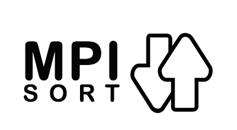

<!-- PROJECT LOGO -->
 

  

  <h3 align="center">Sorting with MPI</h3>

  

  A fun twist on traditional sorting algorithms that utilizes parallel computing and MPI communication!
     
  

<!-- TABLE OF CONTENTS -->
## Table of Contents
* [About The Project](#about-the-project)
* [Getting Started](#getting-started)
  * [Prerequisites](#prerequisites)
  * [Setup for Openstack](#setup-for-openstack)
 * [Usage](#usage)
* [Contributors](#Contributors)
* [Contact](#contact)

<!-- ABOUT THE PROJECT -->
## About The Project

This project implements the traditional in-place Heapsort algorithm but uniquely apply it while using the power of MPI and parallel computing to distribute the work among multiple processors to make the sorting even more efficient. 

### How It Works

 1. The program starts with a random set of numbers in each processor.
 2. Next each process sorts the values stored in its machine.
 3. Once the set of numbers in each processor are sorted, each processor creates its "p-sample". Essentially each processor creates a list holding each n/p value (n = number of values, p = number of processors).
 4. Next, each processor sends its p-sample list to processor-0.
 5. Processor-0 then sorts all the p-sample values into one ordered list.
 6. Processor-0 then takes this sorted list and creates a global p-sample list and sends this global p-sample to all the processors.
 7. Within each processor distribute each processors values into "buckets" using the global p-sample list to set the number of buckets and what values will go into each bucket. 
 8. Next, have each processor communicate its bucket size to all other processors
 9. Now send each processor buckets to all other processors
 10. Finally, send the sorted post bucket sizes to all and make the appropriate adjustments so each processor has equal (or as close to equal as possible) size of values
 11. Values are now sorted evenly within each processor
 

The main MPI call being used is is MP_Alltoall() as this limits the cost of communication and ensures the costly act of MPI communication between systems is done as efficiently as possible. 

<!-- GETTING STARTED -->
## Getting Started

This project was developed with Java and a slew of other technologies. Please Follow the instructions bellow carefully to download and run the project. If you have any issues please feel free to email me at daschko.l@gmail.com . I would be happy to help or fix any issues you run into.

### Prerequisites

Here the things you need to run the code:
 - C++
 - MPI
 - Openstack
 

### Setup for Openstack
Ensure you have access to an Openstack program that gives access to utilizing a large array of machines. I was lucky enough to be able to use my universities Openstack system for this cool project. It is likely you probably don't have access to this and sadly it won't be obvious how to run my program in your position.

I will include my schools instructions of how to setup Openstack to work this program however. This general set of steps is what I used to make my project work.
 [Openstack Instructions](https://carleton.ca/scs/wp-content/uploads/OpenStack_MPI_2018-09-18.pdf)

 

<!-- USAGE EXAMPLES -->
## Usage

To use the program is pretty simple to use once you have set-up everything with Openstack. I have provided input and (correct) output files that each processor should read in and the code includes a function to intelligently have each processor read in its file of values. From there, just run the code appropriately through Openstack and see how the results compare to the output files!

<!-- CONTACT -->
## Contact

Luke Daschko - [@lukeduker](https://www.instagram.com/lukeduker/) - daschko.l@gmail.com

Project Link:[https://github.com/LukeVibes/MPI_Sorting](https://github.com/LukeVibes/MPI_Sorting)

<!-- MARKDOWN LINKS & IMAGES -->
[build-shield]: https://img.shields.io/badge/build-passing-brightgreen.svg?style=flat-square
[contributors-shield]: https://img.shields.io/badge/contributors-1-orange.svg?style=flat-square
[license-shield]: https://img.shields.io/badge/license-MIT-blue.svg?style=flat-square
[license-url]: https://choosealicense.com/licenses/mit
[linkedin-shield]: https://img.shields.io/badge/-LinkedIn-black.svg?style=flat-square&logo=linkedin&colorB=555
[linkedin-url]: https://linkedin.com/in/othneildrew
[product-screenshot]: https://raw.githubusercontent.com/othneildrew/Best-README-Template/master/screenshot.png
